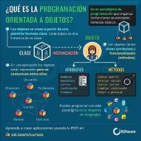

<!DOCTYPE html>
<html lang="es">
<head>
    <meta charset="UTF-8">
    <meta name="viewport" content="width=device-width, initial-scale=1.0">
    <!--nombre de la pagina-->
    <title>pagina web Jaime</title>
    <!--favicon es un icono o imagen que se inserta para personalizar 
        la pagina-->
    <link rel="shortcut icon" href="faviconjaime.png" type="image/x-icon">
    <!--se crea un subprograma en css estilos para llamar a funciones 
        o arreglos-->
    <link rel="stylesheet" href="estilos.css">
    <!--se pega el linck de open sans obtenido de google fonts
    https://fonts.google.com/specimen/Open+Sans?query=open+sans&sidebar.open&selection.family=Open+Sans:ital,wght@0,300;0,400;0,600;0,800;1,800#standard-styles-->
    <link href="https://fonts.googleapis.com/css2?family=Open+Sans:ital,wght@0,300;0,400;0,600;0,800;1,800&display=swap" rel="stylesheet">
</head>
<body>
   <header>
       <!--dentro del header se usa nav con un elemento a href con una 
        almohadilla para que no valla a ningun lado para los titulos 
        de inicio de pagina-->
       <nav>
           <a href="#">Inicio</a>
           <a href="#">Acerca de</a>
           <a href="#">Portafolios</a>
           <a href="#">Servicios</a>
           <a href="#">Contactos</a>
       </nav>
       <!--con section class "textos-header" se colocan los titulos y 
        subtitulos-->
       <section class="textos-header">
           <h1>Proyecta tu imagen</h1>
           <h2>Con una pagina web potente</h2>
       </section>
       <!--con un dib de class "wave" ola se hace el efecto de hola, en style 
        tenemos un height altura, overflow desbordamiento. un segundo style 
        con height-altura 100% y width-ancho 100%. un tercer style con 
        stroke-trazo ninguno y fill-relleno de este codigo esta el color 
        que se le desea poner, se encuentra este codigo en este enlace: 
        https://smooth.ie/blogs/news/svg-wavey-transitions-between-sections-->
       
<svg viewBox="0 0 500 150" preserveAspectRatio="none" 
              style="height: 100%; width: 100%;">
              <path d="M0.00,49.98 C206.26,223.52 274.54,49.83 500.00,49.98 L500.00,150.00 L0.00,150.00 Z" 
              style="stroke: none; fill: #fff;"></path>
            </svg>

   </header>
   <!--se crea un main y con section se va generando la sección-->
   <main>
       <section class="contenedor sobre-nosotros">
           <h2 class="titulo">Nuestro producto</h2>
           <!--se crea un dib class contendor-sobre-nosotros para contener 
            la imagen con una class "imagen-about-us" y tambien contiene 
            un div class "contenido-textos" -->
           

               
               

                   <!--dentro del div tenemos un h3 donde pondresmos un span 
                    y llevara un numero para darle un estilo al texto-->
                   <h3>1Los mejores desarrollos</h3>
                   <!--elemento p que contiene un loren-->
                   
Lorem ipsum dolor sit amet consectetur adipisicing elit. Fugiat reiciendis eos ab labore commodi quia. Quas, vel, dolorem in perspiciatis quo voluptatibus, corrupti beatae ea placeat omnis eveniet voluptates similique?

                   <!--se copia el h3 y p y se le cambia en el span el numero
                    1 por el 2-->
                   <h3>2Los mejores desarrollos</h3>
                   
Lorem ipsum dolor sit amet consectetur adipisicing elit. Fugiat reiciendis eos ab labore commodi quia. Quas, vel, dolorem in perspiciatis quo voluptatibus, corrupti beatae ea placeat omnis eveniet voluptates similique?

               

           

       </section>
       <!--se crea un section con identificador de portafolio-->
       <section class="portafolio">
           <!--se crea un div contenedor-->
           

               <!--se crea el titulo portafolio-->
               <h2 class="titulo">Portafolios</h2>
               <!--se crea un div cass "galeria-port"-->
               

                   <!--se crea un div class "imagen-port"-->
                   

                       
                       <!--dentro va otro div class "hover-galeria" con su 
                        img de nombre dedo.png que sera el icono de señalar-->
                       

                           
                           <!--dentro llevara un p con un texto-->
                           
Nuestro trabajo

                       

                   

                   

                       
                       <!--dentro va otro div class "hover-galeria" con su 
                       img de nombre dedo.png que sera el icono de señalar-->
                       

                           
                           <!--dentro llevara un p con un texto-->
                           
Nuestro trabajo

                       

                    

                    

                        
                        <!--dentro va otro div class "hover-galeria" con su 
                         img de nombre dedo.png que sera el icono de señalar-->
                        

                            
                            <!--dentro llevara un p con un texto-->
                            
Nuestro trabajo

                        

                    

                    

                        
                        <!--dentro va otro div class "hover-galeria" con su 
                         img de nombre dedo.png que sera el icono de señalar-->
                        

                            
                            <!--dentro llevara un p con un texto-->
                            
Nuestro trabajo

                        

                    

                    

                        
                        <!--dentro va otro div class "hover-galeria" con su 
                         img de nombre dedo.png que sera el icono de señalar-->
                        

                            
                            <!--dentro llevara un p con un texto-->
                            
Nuestro trabajo

                        

                    

                    

                        
                        <!--dentro va otro div class "hover-galeria" con su 
                         img de nombre dedo.png que sera el icono de señalar-->
                        

                            
                            <!--dentro llevara un p con un texto-->
                            
Nuestro trabajo

                        

                    

                    

                        
                        <!--dentro va otro div class "hover-galeria" con su 
                         img de nombre dedo.png que sera el icono de señalar-->
                        

                            
                            <!--dentro llevara un p con un texto-->
                            
Nuestro trabajo

                        

                    

                    

                        
                        <!--dentro va otro div class "hover-galeria" con su 
                         img de nombre dedo.png que sera el icono de señalar-->
                        

                            
                            <!--dentro llevara un p con un texto-->
                            
Nuestro trabajo

                        

                    

                

           

       </section>
       <!--se crea un div class llamado clientes contenedor-->
       <section class="clientes contenedor">
           <!--se coloca un titulo-->
           <h2 class="titulo">Que dicen nuestros clientes</h2>
           <!--se crea un div cards porque es el que lleva todo-->
           

               <!--se crea un div que se llama card y llevara 
               una imagen y otro div class "contenido-texto-card"
               con un h4 Name y un p lorem10-->
               

                   
                   

                       <!--el name es de la persona que esta testificando
                       acerca de nosotros.-->
                       <h4>Name</h4>
                       
Lorem ipsum dolor sit amet consectetur adipisicing elit. Quidem, officia.

                   

               

               <!--se copia y pega el div class "card" anterior -->
               

                
                

                    <h4>Name</h4>
                    
Lorem ipsum dolor sit amet consectetur adipisicing elit. Quidem, officia.

                

            

           

       </section>
       <!--se crea otra section class "about-services" para
        nuestros servicios-->
        <section class="about-services">
            <!--se coloca un contenedor-->
            

                <h2 class="titulo">Nuestros servicios</h2>
                <!--se crea un div de la clase "servicio-cont"-->
                

                    <!--se crea dentro otro div class "servicio-ind"
                    el cual contiene una img., un h3 con el 
                    Name y un p con un lorem10-->
                    

                        
                        <h3>Name</h3>
                        
Lorem ipsum dolor sit amet consectetur adipisicing elit. Soluta, minima.

                    

                    <!--se copia y se pegan los div class 
                    "servicio-int" las veces necesarias para
                    colocar los servicios. se agregan las 
                    imagenes alucivas al servicio.-->
                    

                        
                        <h3>Name</h3>
                        
Lorem ipsum dolor sit amet consectetur adipisicing elit. Soluta, minima.

                    

                    

                        
                        <h3>Name</h3>
                        
Lorem ipsum dolor sit amet consectetur adipisicing elit. Soluta, minima.

                    

                

            

        </section>
   </main>
   <!--se crea un footer que contenga la ultima parte del código-->
   <footer>
       

           <!--dentro de un contenedor-footer se crea un div class
            content-foo para almacenar un h4 y un p con un numero-->
           

               <h4>Phone</h4>
               
3192429987

           

           

               <h4>Email</h4>
               
jgomez0685@misena.edu.co

            

           

               <h4>Location</h4>
               
Calle 19 # 16-02

            

       

       <h2 class="titulo-final">&copy;Jagc | Jaime Gómez Cañar</h2>
   </footer>
</body>
</html>
